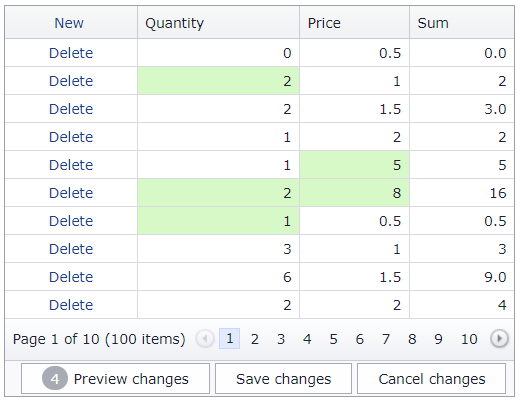

<!-- default badges list -->

[](https://supportcenter.devexpress.com/ticket/details/T124603)
[](https://docs.devexpress.com/GeneralInformation/403183)
[](#does-this-example-address-your-development-requirementsobjectives)
<!-- default badges end -->
# Grid View for ASP.NET MVC - How to calculate values dynamically in batch edit mode

This example demonstrates how to create an unbound column (**Sum**) that changes its values based on other column values dynamically in batch edit mode.



## Overview

Follow the steps below:

1. Set the unbound column's [ShowEditorInBatchEditMode](https://docs.devexpress.com/AspNet/DevExpress.Web.GridDataColumnSettings.ShowEditorInBatchEditMode) property to `false` to make the column read-only in batch edit mode.

    ```csharp
    settings.Columns.Add(column => {
        column.UnboundType = DevExpress.Data.UnboundColumnType.Decimal;
        column.FieldName = "Sum";
        column.ReadOnly = true;
        column.Settings.ShowEditorInBatchEditMode = false;
    });
    ```

2. Handle the grid's client-side [BatchEditEndEditing](https://docs.devexpress.com/AspNet/js-ASPxClientGridView.BatchEditEndEditing) event. In the handler, recalculate column values based on the changes and call the [SetCellValue](https://docs.devexpress.com/AspNet/js-ASPxClientGridViewBatchEditApi.SetCellValue(visibleIndex-columnFieldNameOrId-value)) method to set the new column value.

    ```js
    function OnBatchEditEndEditing(s, e) {
        var PriceColIndex = s.GetColumnByField("Price").index;
        var QuantityColIndex = s.GetColumnByField("Quantity").index;
        var priceValue = e.rowValues[PriceColIndex].value;
        var quantityValue = e.rowValues[QuantityColIndex].value;
        s.batchEditApi.SetCellValue(e.visibleIndex, "Sum", priceValue * quantityValue, null, true);
    }
    ```

## Files to Review

* [_GridViewPartial.cshtml](./CS/GridViewBatchEdit/Views/Home/_GridViewPartial.cshtml)
* [Index.cshtml](./CS/GridViewBatchEdit/Views/Home/Index.cshtml)

## Documentation

* [Unbound Columns](https://docs.devexpress.com/AspNetMvc/16859/components/grid-view/concepts/data-representation-basics/columns/unbound-columns)
* [Batch Edit Mode](https://docs.devexpress.com/AspNetMvc/16147/components/grid-view/concepts/data-editing-and-validation/batch-edit)

## More Examples

* [GridView for Web Forms - How to calculate values dynamically in batch edit mode](https://github.com/DevExpress-Examples/asp-net-web-forms-gridview-calculate-values-dynamically-batch-mode)
<!-- feedback -->
## Does this example address your development requirements/objectives?

[](https://www.devexpress.com/support/examples/survey.xml?utm_source=github&utm_campaign=asp-net-mvc-grid-dynamic-calculation-in-batch-mode&~~~was_helpful=yes) [](https://www.devexpress.com/support/examples/survey.xml?utm_source=github&utm_campaign=asp-net-mvc-grid-dynamic-calculation-in-batch-mode&~~~was_helpful=no)

(you will be redirected to DevExpress.com to submit your response)
<!-- feedback end -->
